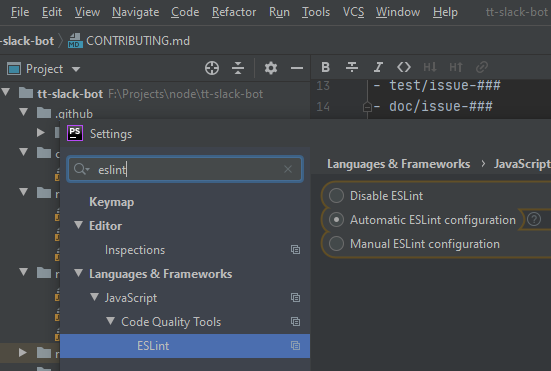
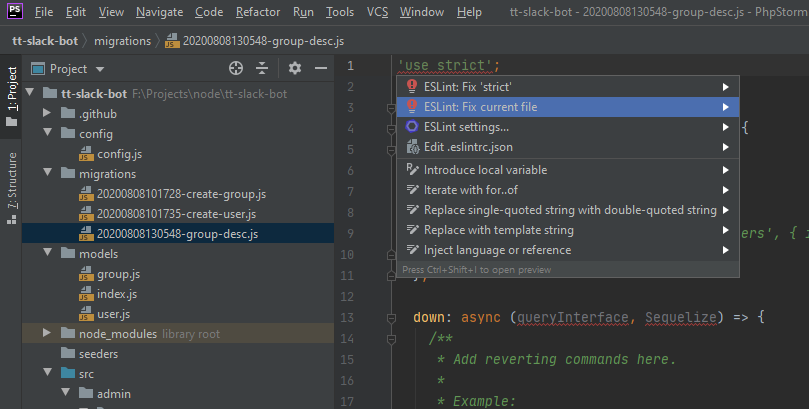

TODO: https://docs.github.com/en/github/building-a-strong-community/about-issue-and-pull-request-templates

# Contributing to the Slack Bot
We ask that all contributions have a github issue linked to their PR. This way it is easier
for everyone to know if someone is already working on an issue.

## Branching
Always branch off the master branch with the proper branch name:
- bug/issue-###
- feat/issue-###
- test/issue-###
- doc/issue-###

## Commit messages
We ask that the commit messages reflects logically what was done in that commit.
If you have too many erratic commits *we will ask you* to rebase all your commits.

## Code style guide
We follow the javascript standard [Airbnb](https://github.com/airbnb/javascript).
You dont have to really read the whole thing, you can setup your IDE (phpstorm)
correctly to guide you through as you code:



## Tests
- We ask that you make tests for your changes
- Extra bot permissions? (github template)

## Changing the schema
The ORM being used is [Sequelize](https://sequelize.org/master/index.html), if you want
to modify the schema it is strongly suggested to install the [Sequelize-Cli](https://github.com/sequelize/cli) locally:
```bash
npm install -g sequelize-cli
```

New [model](https://sequelize.org/master/manual/migrations.html#creating-the-first-model--and-migration-):
```bash
sequelize model:generate --name group --attributes name:string
```

New [migration](https://sequelize.org/master/manual/migrations.html#migration-skeleton):
```bash
sequelize migration:create --name group-desc
```

**NOTE:** By default the files created do not have the proper code style standard [Airbnb](https://github.com/airbnb/javascript), but
you can easily fix it with phpstorm if you are setup properly:



