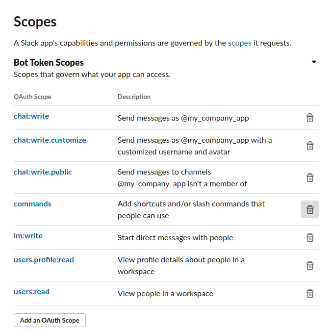

# Slack Multi APPs
Supports multiple sub-apps within the same structure,
governed by a centralized group ACL. The project is not meant to be published on the Slack APP 
directory as a standalone app. It is more geared towards bootstrapping a self-hosted enterprise
Slack application after customizing it to the enterprise's needs. Such as deployment of the company's
product to various internal environments (QA, Staging, Production) for example. All through the
enterprise's Slack.

For more information on the [Slack Module System](./src/slack-modules/README.md) and how it is structured.

For more information on the access restrictions you can read about the [Admin Module](./src/slack-modules/admin/README.md).

The project comes with [Poll Module](./src/slack-modules/poll/README.md)
& [Agile Pulse Module](./src/slack-modules/agile/pulse/README.md), which serves as
an example of how the module system works with modals, 
interactions, form submission, generating charts, periodic tasks, download of custom data, etc...

#### The libraries
At its core it is built with [NodeJS](https://nodejs.org/) on top of the HTTP framework [Express](https://expressjs.com/).
Our ORM of choice is [Sequelize](https://sequelize.org/).
We are using [Mocha](https://mochajs.org/), [Chai](https://www.chaijs.com/) 
and [mock-require](https://github.com/boblauer/mock-require) for the [tests](./test/README.md).
The project applies the [ESLint](https://eslint.org/) 
[Airbnb](https://github.com/airbnb/javascript) standard, 
to keep in mind when [contributing](./CONTRIBUTING.md) to the project.

There are several [custom express middleware](./src/middlewares/README.md) to ease the development
of the sub-apps. Also [Sequelize](https://sequelize.org/) should be used according to 
the [following details](./sequelize/README.md). 
I encourage everyone to read both before starting development.

### The Slack APP required scopes


The APP will also require to activate the following functionalities:
- Interactive Components
- Slash Commands
- Bots

With the proper URLs for the environment you are setting up.

## Local development environment
For development, I recommend a separate Slack Workspace than the one used for production as they
both require their own callback URLs. For the local environment I strongly suggest using 
[ngrok](https://ngrok.com/), which is a tool to open a tunnel to your machine so Slack can talk to it. 
It has a reasonable price for permanent _ngrok.io_ sub-domain names, this way we don't have to change
the Slack app URL configurations every time we restart [ngrok](https://ngrok.com/).

The first thing to get the local development environment going is to copy `.env-example` 
to `.env` and changing the environment variables to the desired values. A connection to
an SQL server (MySQL, MariaDb, Postgres, etc...), and an existing database which is defined
in the `.env` under `MYSQL_DATABASE`. If you do not wish to use [MySQL](https://www.mysql.com/),
you will have to change the variable names as well as the [Sequelize](https://sequelize.org/)
config connection url which is defined in `config/sequelize.js`.

### With Docker
The simplest way to get a [MySQL](https://www.mysql.com/) server going is probably to run
the [official docker image](https://hub.docker.com/_/mysql) like so:
```bash
docker run \
    --rm \
    --name mysql-server \
    -p 3306:3306 \
    -e MYSQL_PORT=3306 \
    -e MYSQL_DATABASE=slack_app \
    -e MYSQL_ROOT_PASSWORD=my-password \
    -e MYSQL_USER=slack \
    -e MYSQL_PASSWORD=my-password \
    -d mysql:latest
```

The docker run commands can be lengthy thus we have added a bash shortcuts in `bin/*` which
points in the container. To get the app running execute the following:
```bash
// Build image
docker build -t slack-app .

// npm install node_modules in the container for its specific node version 
// which installs them in the project's root because of the -v volume
bin/npm install

// Start the server in dev mode
bin/start_app run dev

// Execute ESLint
bin/npm run lint

// Execute the tests
bin/npm run test

// Stop the server
bin/stop_app
```

To create new [Sequelize](https://sequelize.org/) Models & Migrations we created another shortcut in `bin/sequelize`.
You can use it like so:
```bash
bin/sequelize 

// Check migration status
bin/sequelize migrate:status
```

## Without Docker
You will need install [NodeJS](https://nodejs.org/) locally and the following packages globally:
```bash
sudo apt install sqlite3

npm install -g coveralls nyc nodemon sequelize-cli
npm install

// Run the linter
npm run lint

// Run the tests
npm run test

// Check migration status
sequelize db:migrate:status

// Start the server in dev mode
npm run dev
```

### Once server running
In either case the database `slack_app` need to exists and be the database user need to be able to create and alter tables.

We recommend the SQL client [DBeaver](https://dbeaver.io/), you can connect to the database server
(_localhost ports with or without docker_) to verify that everything has been created correctly 
and monitor results as you develop your app.

When running in dev it will first run the database migrations and seeds then starts the app
with [nodemon](https://nodemon.io/) which will handle the hot reload (_restart the server_) when you modify files.

Referer to [package section](./package.json) for the details of the scripts.
