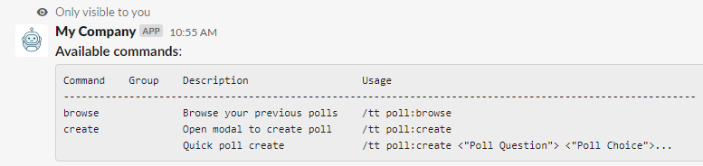

## Express Middlewares


As you can see in the [index.js](./src/index.js) there are five middlewares to setup multiple
things for the [module system](../slack-modules/README.md). The order in which they are being
executed matters and is the following:
```javascript
app.use(currentUser());
app.use(slackModulePath);
app.use(slackUserActivity());
app.use(slackGroupACL());
app.use(slackAvailableCommands);
```

#### Current User
Tasked with looking up the current slack users (_Slack ID_) in the **_users_** table, if
it does not exist it will create an entry and make a call to Slack API to retrieve the profile
information and store it in **_user_profiles_**.

Once it is created/found it will store the [Sequelize](https://sequelize.org/) User model
in the `req.currentUser`. Which will be passed to the [Slack Module](./src/slack-modules/README.md)'s functions
by the [src/utils.js:processRequest()](../utils.js).

#### Slack Module Path
Tasked to construct the `req.slack` objects which contains multiple information from the Slack payload
of the request. A default structure looks like this:
```json
{
  "module": {
    "path": [],
    "params": {}
  },
  "view": null,
  "channelId": null,
  "triggerId": null,
  "responseUrl": null,
  "isCommand": false,
  "isInteraction": false,
  "isModalSubmission": false
}
```
When the server is started the directory `src/slack-modules` is crawled recursively, and made into a tree
array. The normal Slack Payload path  (_ex: `/myslash admin:users:list`_) is deconstructed
into the `req.slack.module.path` as an array, so it can be matched against the module tree.
The "path" may come from three sources:
- _Interactions_
    - `req.body.payload.actions[0].value`
- _Modal Submit_
    - `req.body.payload.view.private_metadata`
- _Slash command_
    - `req.body.text`

The `req.slack.module.params` also come from the same sources. Here is a couple of examples:
```
poll:create "My Poll Question" "Choice number 1" "Choice number 2"
poll:create addChoice=1
poll:choices add=1&pollId=3
poll:info pollId=5
```
The params in the string/path are a normal query string which is deconstructed into the
`req.slack.module.params` object. As the first example above when a slash command passes
multiple arguments it is deconstructed into `req.slack.module.params.values` array.

Once it is constructed it will store it in `req.slack`. Which will be passed to the 
[Slack Module](./src/slack-modules/README.md)'s functions by [src/utils.js:processRequest()](../utils.js).

#### Slack User Activity
Tasked to track all user activity, logs them in the table **user_activities**. 
It also adds the current activity to the `req.currentActivity` and also the last activity
by the user in `req.lastActivity` if any. Both properties represent the [Sequelize](https://sequelize.org/) 
UserActivity model so it can be altered by another middleware, such as adding the response.

#### Slack Group ACL
Tasked to block access for a protected module path by a group(s), if the user is not part
of any groups that have access the middleware will stop the process and exit with an
access deny to the user.

When protecting a module path it can be partial like `admin*`, that protected path is used
as a RegExp expression:
````javascript
    const regex = new RegExp(paths[i], 'i');
    if (modulePath.match(regex)) {
    }
```` 

#### Slack Available Commands
Tasked to crawl the module tree constructed by `slack-module-path` to see if we need to stop the process
and show the available commands. If the module path depth does not have any of the following `js` files:
`command.js`, `interactions.js` or `modal-submit.js`, but has a `info.json` then it signifies that we need
to stop the process and should the module's path depth available commands.

Here is an example of a `info.json` for the Poll Create command:
```json
{
  "name": "create",
  "desc": [
    "Open modal to create poll",
    "Quick poll create"
  ],
  "usage": [
    "/tt poll:create",
    "/tt poll:create <\"Poll Question\"> <\"Poll Choice\">..."
  ]
}
``` 

Which appears like so in slack:

As you can see, the properties `desc` and `usage` are array to give examples on how to
use the command correctly.

When the command is not found, for example `poll:creato` it will stop the process and
give the available commands for the command's path depth:


Otherwise it will just let the module flow through the middlewares
all the way to its designed module `js` file.
