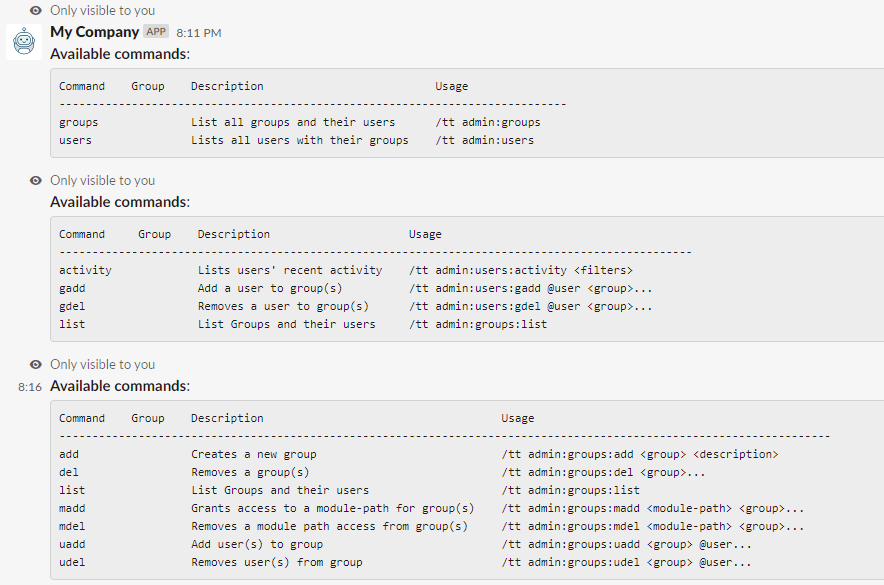

## Admin Module
Governs if a user has access to certain modules. Users dont have permissions per-say, they
are assigned to groups that have access to module paths.

Like any other module path, the [available commands](../../middlewares/README.md) can be listed with the following commands:
```bash
/myslash admin
/myslash admin:users
/myslash admin:groups
```


### First Boot of the APP
When the APP is running for the first time, there are no module path protected. Not even the
admin module path. **But** the admin group exists, it is just not assigned to any module paths yet.
**The first thing to do** is to assign your user to the **admin** group with the following commands:
```bash
/myslash admin:groups:uadd admin @your-user

// OR
/myslash admin:users:gadd @your-user admin
```

Then the **admin path should be protected** with the following command:
```bash
/myslash admin:groups:madd admin:* admin
```
