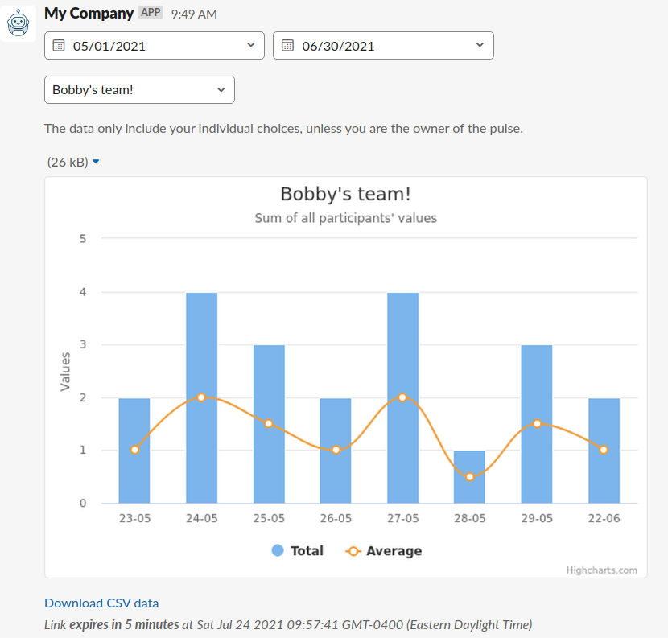

## Agile Pulse Module
Allows users to schedule periodic small surveys to a slack users.

Like any other module you can get the [available commands](../../middlewares/README.md) by typing the command `/myslash agile:pulse`:

To get the creation modal use the command `/myslash agile:pulse:create`:

**Pulse are created at a `paused` state**. So they will never start sending messages right away, soo the browse command to activate them.

Fields are pretty straight forward, where it gets a bit confusing is the choices. Because we will be drawing charts
from the answers of the pulse, we need to assign each choice a value that can be displayed on a chart.
The approach that we decided to go with is the order in which they are added. 

The choices are assigned a value from the lsat one to the first. Which means that the last choice you
enter will have a value of 0, meaning it will be defining the bottom of the graph. The first choice's value
will depend on how many choices you have between the first and last.

Lets say the question is `How's your day?`, we could have the following choices:
- Most Excellent
- Good
- Okay
- Bad
- Nightmare

The value assigned would give:
- 4 - Most Excellent
- 3 - Good
- 2 - Okay
- 1 - Bad
- 0 - Nightmare

As users vote every day, choices will be gathered and automatically assigned a value as mention above. You
can retrieve this data by use the command `/myslash agile:pulse:data`, **If you do not have a [HighCharts setup](../../../highcharts/README.md)**, the chart will simply not display.
You will only have the [_Download CSV data_] link:

The data command serves a dual purpose, if its used as the pulse's creator **all members data** will be displayed / downloadable.
But if you are looking at a pulse's data where you are only a member, you will see only your own data and **not** all the data 
of the members of the pulse. .

As you can see there is a link _Download CSV data_ which is only valid for 5 minutes, for security reasons. The data that is in the CSV file **will not include** which member picked which choices,
you will get the keywords they entered and every choices per date but not the owner of the choices. The link to
download the data is bound by the same rules of pulse creator vs member. The 5 minutes starts when it is done loading the 
Slack message and is reset every time it loads.

You can browse the agile pulses that you created with the command `/myslash agile:pulse:browse`:

Three main functionality to the pulse info, while browsing. The most important one is to be able to change the status
of your pulse to active. Pulse are created  at a `paused` state, and need to be activated manually with the browse command.
Otherwise the message will not be sent.

The second most important, would be the ability to modify the members of the pulse.
And last but not least, the ability to send yourself a sample of the message, which should look a lot like this:

As you can see, all members of the pulse will have the ability to remove themselves from the pulse. They also
can add keywords to remind them of their choices.
