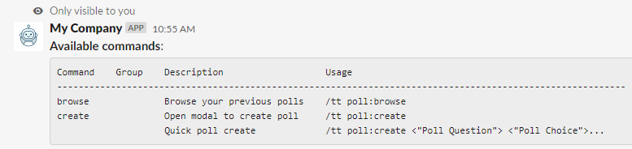
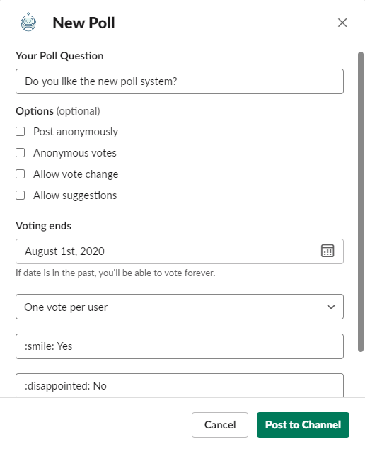
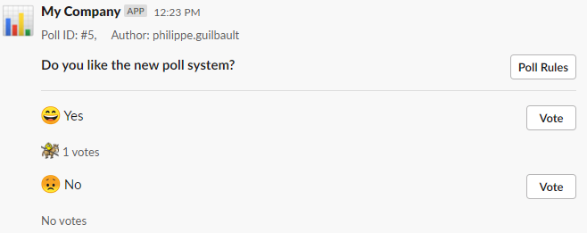
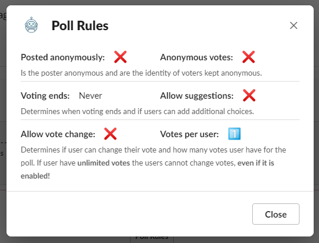
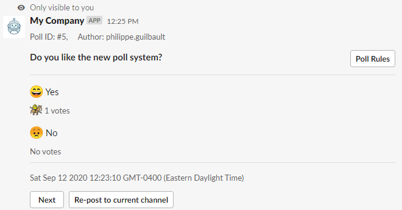

## Poll Module
Allows users to be able to post polls to private & public channels.

Like any other modules you can get the [available commands](../../middlewares/README.md) by typing the command
`/myslash poll`:

As you can see there are two ways to create a poll, through a modal and a quick create.
The quick create only requires a question and choices and it will set the default options for the poll,
and post it to the current channel. For the creation through the modal we get
can use the command `/myslash poll:create` to open the modal:

We dont see it but at the bottom there is a button to add additional suggestions to the poll modal.
If a choice starts with an emoji **_:smile:_** it will not put the standard emojis for the choices:

When posted to the current channel it will look like:

Once posted on the channel we have the button **_Poll Rules_** to show the rules of the
current poll in a modal:

The poll module also allows users to browse the history of their polls with the following
command `/myslash poll:browse`

It allows the use to browse all the polls they did in the past with the option to **_Re-post to current channel_** doing so will not reset the
poll. It will just post the current state back to the current channel.
